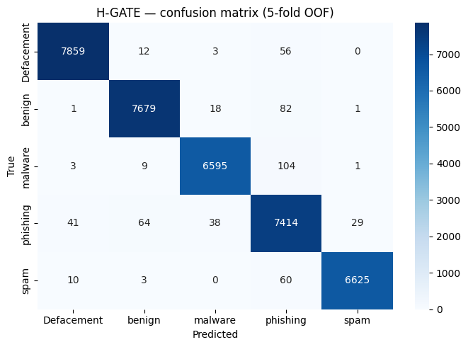
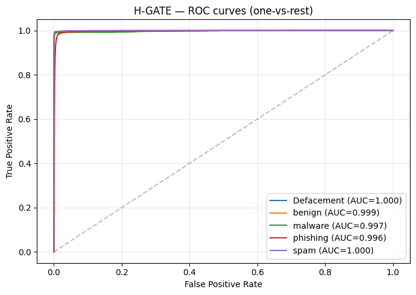
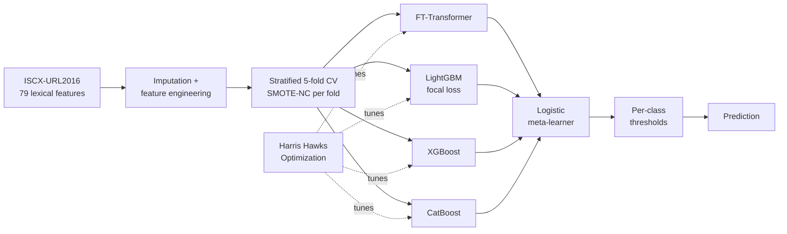
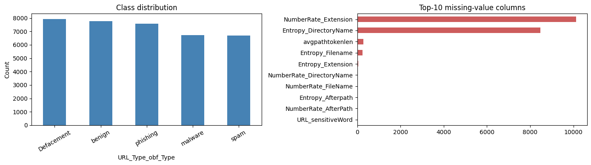

# H-GATE — Malicious URL Detection

[](https://colab.research.google.com/github/Inesaini/hgate-malicious-url-detection/blob/main/HGATE_Malicious_URL_Detection.ipynb)

**H**arris-Hawks-Optimized **G**radient-boosted **A**ttention-**T**ransformer **E**nsemble: a
hybrid stacking model that classifies URLs into five classes (benign, defacement, malware,
phishing, spam) on the ISCX-URL2016 dataset.

The goal is twofold: maximize accuracy and push the False Positive Rate as low as possible,
since in a security setting every false alarm blocks a legitimate site.

## Results

5-fold out-of-fold evaluation on 36,707 URLs:

| Model | Accuracy | Macro F1 | Macro FPR | Macro AUC |
|---|---|---|---|---|
| Logistic Regression | 85.49% | 0.8543 | 3.64% | 0.9765 |
| Random Forest | 97.64% | 0.9768 | 0.59% | 0.9990 |
| XGBoost (vanilla) | 98.38% | 0.9839 | 0.41% | 0.9993 |
| **H-GATE (HHO-tuned)** | **98.54%** | **0.9856** | **0.37%** | 0.9984 |

Per-class results for H-GATE:

| Class | Precision | Recall | F1 | FPR |
|---|---|---|---|---|
| Defacement | 0.9931 | 0.9910 | 0.9920 | 0.19% |
| Benign | 0.9887 | 0.9869 | 0.9878 | 0.30% |
| Malware | 0.9911 | 0.9826 | 0.9868 | 0.20% |
| Phishing | 0.9609 | 0.9773 | 0.9690 | 1.04% |
| Spam | 0.9953 | 0.9891 | 0.9922 | 0.10% |

Phishing is the hardest class: its URLs are built to look legitimate. Most of the remaining
errors are other classes predicted as phishing, as the confusion matrix shows.

<p align="center">
  
  
</p>

Decision thresholds found by the per-class tuning step:

| Defacement | Benign | Malware | Phishing | Spam |
|---|---|---|---|---|
| 0.35 | 0.70 | 0.60 | 0.25 | 0.45 |

The benign threshold is the highest, so a URL is only flagged as benign when the model is
confident about it.

### Comparison with plain gradient boosting

Under the same 5-fold protocol, H-GATE gains 0.16 points of accuracy over plain XGBoost and
lowers the macro FPR from 0.41% to 0.37%. The gain is small. The Harris Hawks search ran with
the `fast` profile (see [Run it](#run-it)), and the tuned XGBoost of the
[baseline study](https://github.com/Inesaini/malicious-url-detection-ml-dl) reaches 98.60%
accuracy and 0.35% FPR on a single 80/20 split. The two protocols differ (one test split
against out-of-fold predictions on the whole dataset), so the numbers are not directly
comparable. Still, most of the performance on these lexical features already comes from
gradient boosting, and a longer HHO search is the obvious next step.

## How it works



1. **Preprocessing** — infinities replaced, iterative (MissForest-style) imputation, binary
   missingness indicators for the most incomplete columns, and engineered interaction
   features.
2. **Stratified 5-fold cross-validation** with SMOTE-NC applied inside each fold only, so no
   synthetic sample leaks into validation data.
3. **Four base learners**
   - FT-Transformer: each feature is tokenized and passed through self-attention layers
     (lightweight PyTorch implementation, included in the notebook)
   - LightGBM with a custom focal-loss objective, which concentrates the gradient on hard,
     easily confused samples
   - XGBoost with class weights
   - CatBoost with balanced class weights
4. **Logistic meta-learner** trained on the out-of-fold probability vectors of the four
   base learners.
5. **Harris Hawks Optimization** of the joint hyperparameter vector, with a fitness function
   that penalizes false positives.
6. **Per-class threshold tuning** that minimizes macro-FPR while keeping recall high.
7. **SHAP analysis** of the LightGBM branch to show which URL features drive the decisions.

## Repository contents

| File | Description |
|---|---|
| `HGATE_Malicious_URL_Detection.ipynb` | The full notebook, with outputs and figures |
| `figures/` | Figures used in this README, exported from the notebook |
| `requirements.txt` | Python dependencies |

## Dataset

[ISCX-URL2016](https://www.unb.ca/cic/datasets/url-2016.html) from the Canadian Institute for
Cybersecurity. The notebook uses `All.csv`, which contains 79 pre-extracted lexical features
per URL and a class label. The dataset is not included in this repository; download it from
the link above.

The five classes are fairly balanced (6,698 to 7,930 URLs each). A few columns have many
missing values, which is why the preprocessing adds missingness indicators.



## Run it

The notebook was developed on Google Colab with a GPU.

1. Download `All.csv` from the dataset page.
2. On Colab: place it in `MyDrive/hgate/` and run all cells; the notebook mounts Google Drive
   and caches intermediate results there.
3. Locally: place `All.csv` next to the notebook, then

```bash
pip install -r requirements.txt
jupyter notebook HGATE_Malicious_URL_Detection.ipynb
```

The Harris Hawks search is the slowest step; intermediate results are cached with `joblib`
so later runs reuse them. Its budget is set by `HHO_PROFILE` (`fast`, `medium` or `full`).
The results above come from the `fast` profile (15% of the data, 3 hawks, 2 iterations), so
a larger search may improve them.

## Tech stack

Python, PyTorch, LightGBM, XGBoost, CatBoost, scikit-learn, imbalanced-learn, SHAP, pandas,
NumPy, Matplotlib, Seaborn.

## About the project

Mini project for the **Data Security** (Sécurité des Données) module, 2SC IASD, École
Supérieure en Informatique de Sidi Bel Abbès (2025/2026).

A baseline study using classical ML and deep learning models on the same dataset is in
[malicious-url-detection-ml-dl](https://github.com/Inesaini/malicious-url-detection-ml-dl).

## References

- A. A. Heidari et al., "Harris hawks optimization: Algorithm and applications", *Future
  Generation Computer Systems*, 2019.
- Y. Gorishniy et al., "Revisiting Deep Learning Models for Tabular Data", *NeurIPS*, 2021.
- T.-Y. Lin et al., "Focal Loss for Dense Object Detection", *ICCV*, 2017.
- M. S. I. Mamun et al., "Detecting Malicious URLs Using Lexical Analysis", *NSS*, 2016
  (ISCX-URL2016).
